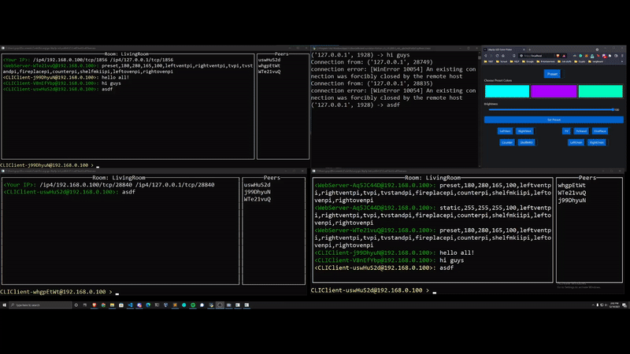

# LedServer

This project builds a Led controller application using go-libp2p-pubsub. The app runs in the terminal, and hosts a webgui to control the LEDs. It There is also a Command line interface to see all peers and communications.



The goal of this example is to demonstrate the basic usage of the `PubSub` API, without getting into
the details of configuration.

## Run Server

Clone this repo, then `cd` into the `LedServer` directory:

```shell
git clone https://github.com/GreysonLatinwo/go-libp2p-led-publish
cd go-libp2p-led-publish/LedServer
```

Now you can either run with `go run`, or build and run the binary:

```shell
go build .
sudo ./LedServer
```

To set a nickname, use the `-name` flag:

```shell
go run . -name=Dev1
```

You can join a specific chat room with the `-room` flag:

```shell
go run . -room=Living-Room
```

visit http://localhost/ to use the web client

To quit, hit `Ctrl-C`

## Code Overview

In [`main.go`](./main.go), we create a new libp2p `Host` and then create a new `PubSub` service
using the GossipSub router:

```go
func main() {
	// (omitted) parse flags, etc...

	// create a new libp2p Host that listens on a random TCP port
	h, err := libp2p.New(libp2p.ListenAddrStrings("/ip4/0.0.0.0/tcp/0"))
	if err != nil {
		panic(err)
	}

	// create a new PubSub service using the GossipSub router
	ps, err := pubsub.NewGossipSub(ctx, h)
	if err != nil {
		panic(err)
	}

   // (omitted) setup mDNS discovery...
   
}
``` 

We configure the host to use local mDNS discovery, so that we can find other peers to chat with
on the local network. We also parse a few command line flags, so we can set a friendly nickname,
or choose a chat room by name.

Once we have a `Host` with an attached `PubSub` service, we join a `ChatRoom`:

```go
    // still in the main func
    cr, err := JoinChatRoom(ctx, ps, h.ID(), nick, room)
  	if err != nil {
  		panic(err)
  	}
```
 
`ChatRoom` is a custom struct defined in [`chatroom.go`](./chatroom.go):

```go
// ChatRoom represents a subscription to a single PubSub topic. Messages
// can be published to the topic with ChatRoom.Publish, and received
// messages are pushed to the Messages channel.
type ChatRoom struct {
	// Messages is a channel of messages received from other peers in the chat room
	Messages chan *ChatMessage

	ctx   context.Context
	ps    *pubsub.PubSub
	topic *pubsub.Topic
	sub   *pubsub.Subscription

	roomName string
	self     peer.ID
	nick     string
}
```

A `ChatRoom` subscribes to a PubSub `Topic`, and reads messages from the `Subscription`. We're sending our messages
wrapped inside of a `ChatMessage` struct:

```go
type ChatMessage struct {
	Message    string
	SenderID   string
	SenderNick string
}
```

This lets us attach friendly nicknames to the messages for display. A real app might want to make sure that
nicks are unique, but we just let anyone claim whatever nick they want and send it along with their messages.

The `ChatMessage`s are encoded to JSON and published to the PubSub topic, in the `Data` field of a `pubsub.Message`.
We could have used any encoding, as long as everyone in the topic agrees on the format, but JSON is simple and good 
enough for our purposes. 

To send messages, we have a `Publish` method, which wraps messages in `ChatMessage` structs, encodes them, and publishes 
to the `pubsub.Topic`:

```go
func (cr *ChatRoom) Publish(message string) error {
	m := ChatMessage{
		Message:    message,
		SenderID:   cr.self.Pretty(),
		SenderNick: cr.nick,
	}
	msgBytes, err := json.Marshal(m)
	if err != nil {
		return err
	}
	return cr.topic.Publish(cr.ctx, msgBytes)
}
```

In the background, the `ChatRoom` runs a `readLoop` goroutine, which reads messages from the `pubsub.Subscription`,
decodes the `ChatMessage` JSON, and sends the `ChatMessage`s on a channel:

```go
func (cr *ChatRoom) readLoop() {
	for {
		msg, err := cr.sub.Next(cr.ctx)
		if err != nil {
			close(cr.Messages)
			return
		}
		// only forward messages delivered by others
		if msg.ReceivedFrom == cr.self {
			continue
		}
		cm := new(ChatMessage)
		err = json.Unmarshal(msg.Data, cm)
		if err != nil {
			continue
		}
		// send valid messages onto the Messages channel
		cr.Messages <- cm
	}
}
```

There's also a `ListPeers` method, which just wraps the method of the same name in the `PubSub` service:

```go
func (cr *ChatRoom) ListPeers() []peer.ID {
	return cr.ps.ListPeers(topicName(cr.roomName))
}
```

That's pretty much it!